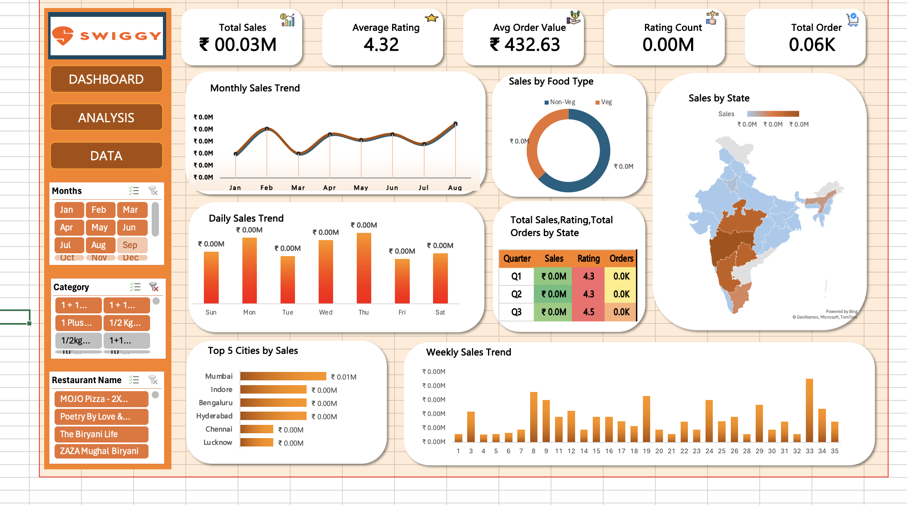

# Swiggy Sales Dashboard (Excel Project)

## Project Overview

This project is an interactive Excel dashboard created using Swiggy sales data.
The dashboard provides insights into sales performance, food category trends, ratings, and regional analysis.

---

## Features

* Monthly Sales Trend Analysis
* Daily Sales Analysis
* Sales by State
* Top 5 Cities by Sales
* Veg vs Non-Veg Sales Comparison
* KPI Cards for Total Sales, Ratings, Orders
* Interactive Slicers and Filters

---

## Tools Used

* Microsoft Excel
* Pivot Tables
* Pivot Charts
* Slicers
* Conditional Formatting

---

## Dashboard Preview

---

## Key Insights

* Non-Veg category generated higher sales
* Mumbai and Bengaluru are top-performing cities
* Weekend orders are comparatively higher
* Average customer rating is above 4.0

---

## Author

Shritika Birajdar
Aspiring Data Analyst
